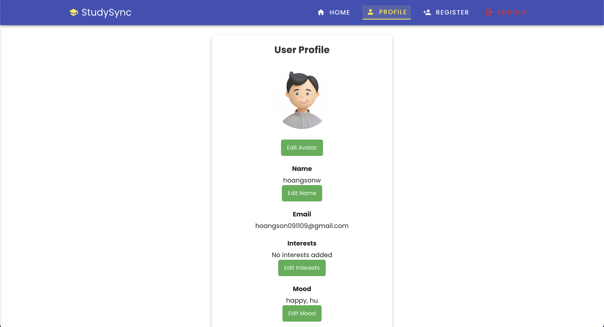

# StudySync - A Productivity and Study Companion App

Welcome to **StudySync**! StudySync is a productivity and study tool designed to help users stay organized and efficient, built with **Vue and Express**. It includes a variety of features such as Pomodoro timers, music recommendations, weather checks, flashcards, to-do lists, and AI chat assistance. It integrates third-party services like Spotify for music and OpenWeather for weather data.

## Table of Contents

- [Features](#features)
- [Live Deployment](#live-deployment)
- [UI Screenshots](#ui-screenshots)
  - [Home Page (Dashboard)](#home-page-dashboard)
  - [Tools List](#tools-list)
  - [Login Page](#login-page)
  - [Register Page](#register-page)
  - [Profile Page](#profile-page)
  - [404 Page](#404-page)
  - [Footer](#footer)
- [Tech Stack](#tech-stack)
  - [Frontend](#frontend)
  - [Backend](#backend)
  - [DevOps & Deployment](#devops--deployment)
- [Getting Started](#getting-started)
- [File Structure](#file-structure)
- [API Documentation](#api-documentation)
  - [Table of API Endpoints](#table-of-api-endpoints)
  - [Backend Swagger Documentation](#backend-swagger-documentation)
  - [OpenAPI Specification](#openapi-specification)
  - [Example of calling the Music Recommendation API](#example-of-calling-the-music-recommendation-api)
  - [Authentication](#authentication)
- [NGINX Configuration](#nginx-configuration)
- [Docker Configuration](#docker-configuration)
  - [Building the Docker Containers](#building-the-docker-containers)
- [The Creator](#the-creator)

## Features

- **Pomodoro Timer**: A built-in timer for Pomodoro study sessions.
- **Music Recommendations**: Get music suggestions based on mood using Spotify.
- **Flashcards**: Create, manage, and study flashcards.
- **To-Do List**: Track study tasks and assignments.
- **Calculator**: A scientific calculator for quick calculations.
- **AI Chat**: Chat with an AI assistant for study tips, help, and queries.
- **Weather Check**: Check the weather for any city using OpenWeather.
- **Quick Notes**: Take and store quick notes for your studies.
- **Daily Motivation**: Receive motivational quotes to keep you going.
- **Study Tips**: Get study tips and advice for effective learning.
- **User Authentication**: Register and login to access personalized features.
- **User Profile**: Craft your profile with study interests and goals.
- **Fully Responsive**: Works on all devices and screen sizes.
- **And More!**: Explore the app for additional features and tools.

## Live Deployment

The app is currently live at [https://study-sync-app.vercel.app/](https://study-sync-app.vercel.app/). You can explore the various features and functionalities of the app, including the Pomodoro timer, music recommendations, weather checks, and AI chat assistance.

The backend API is hosted on Render at [https://studysync-study-buddy-app.onrender.com](https://studysync-study-buddy-app.onrender.com/). The frontend is hosted on Vercel and communicates with the backend API for data retrieval and storage.

> **Note**: The app may take a while to spin up, which means it may take 2-3 minutes (max) to load the backend logic. This is due to Render's free tier resource limit, where we are only allocated 0.1 CPU and 512MB RAM. Thank you for your understanding!

## UI Screenshots

Here are some placeholder UI images for the app:

### Home Page (Dashboard)

<p align="center">
 
</p>

### Tools List

<p align="center">
    
</p>

### Landing Page

<p align="center">
    
</p>

### Login Page

<p align="center">
    
</p>

### Register Page

<p align="center">
    
</p>

### Forgot Password Page

<p align="center">
    
</p>

### Profile Page

<p align="center">
    
</p>

### 404 Page

<p align="center">
    
</p>

### Footer

<p align="center">
    
</p>

## Tech Stack

### Frontend

- **Vue.js** (JavaScript Framework)
- **Vuetify** (Material Design Components)
- **Axios** (HTTP Requests)
- **Vuex** (State Management)
- Markdown Rendering with `marked` (for AI-generated responses)
- **Webpack** (Module Bundler)
- **Babel** (JavaScript Compiler)
- **ESLint** (Code Linter)
- **Prettier** (Code Formatter)
- **Vue Router** (Page Navigation)
- **Vue CLI** (Vue Command Line Interface)

### Backend

- **Node.js with Express.js**
- **MongoDB** (Database)
- **JWT** (Authentication)
- **Spotify API** (for music recommendations)
- **OpenWeather API** (for weather data)
- **Gemini API** (for AI chat functionality)
- **Swagger** (API Documentation)
- **OpenAPI** (API Specification)
- **Nginx** (Reverse Proxy & Load Balancer)

### DevOps & Deployment

- **Git and GitHub** for version control
- **Google Gemini** (for AI chat functionality)
- **OpenWeather API** (for weather data)
- **Docker** (for containerization)
- **Jenkins** (for CI/CD)
- **Vercel and Render** for deployment

## Getting Started

To get started with **StudySync**, you can follow the setup instructions below. The project is divided into two main parts: the frontend and the backend. The frontend is built using Vue.js and Vuetify, while the backend is built using Node.js and Express.js. The backend uses MongoDB as the database.

1. **Clone the repository**:
   ```bash
   git clone https://github.com/hoangsonww/StudySync-Study-Buddy-App.git
   cd StudySync-Study-Buddy-App
   ```
2. **Set up the backend**:
   - Navigate to the `backend` directory:
     ```bash
     cd backend
     ```
   - Install backend dependencies:
     ```bash
     npm install
     ```
   - Set up environment variables by creating a `.env` file:
     ```
     SPOTIFY_CLIENT_ID=<your-spotify-client-id>
     SPOTIFY_CLIENT_SECRET=<your-spotify-client-secret>
     OPENWEATHER_API_KEY=<your-openweather-api-key>
     JWT_SECRET=<your-jwt-secret>
     GEMINI_API_TOKEN=<your-gemini-api-token>
     PORT=5000
     MONGO_URI=<your-mongo-uri>
     AI_INSTRUCTION=<your-ai-instruction>
     ```
   - Start the backend server:
     ```bash
     npm start
     ```
   - The backend server will start on `http://localhost:5000`.
3. **Set up the frontend**:

   - Navigate to the `frontend` directory:
     ```bash
     cd frontend/study-sync-app
     ```
   - Install frontend dependencies:
     ```bash
     npm install
     ```
   - Set up the frontend `.env` file with the API base URL:
     ```
     VUE_APP_API_URL=http://localhost:5000/api
     ```
   - Start the frontend development server:
     ```bash
     npm run serve
     ```
   - Open your browser and go to `http://localhost:8081` to view the app. (The URL may vary based on the port used by Vue CLI - check the terminal output for the correct URL.)

4. **Explore the app**:

   You can now explore the **StudySync** app by navigating through the various features and functionalities. You can use the Pomodoro timer, check the weather, get music recommendations, chat with the AI, and more.

5. **Contribute**:

   If you would like to contribute to the project, feel free to fork the repository and submit a pull request with your changes. We welcome contributions from the community!

## File Structure

```plaintext
StudySync-Study-Buddy-App/
│
├── backend/                            # Backend (Node.js + Express)
│   ├── config/                         # Database and configuration files
│   │   └── db.js                       # Database connection
│   ├── swagger/                        # Swagger API documentation
│   │   └── swagger.js                  # Swagger setup
│   ├── controllers/                    # Controllers handling requests
│   │   └── controllers.js              # Main controller file
│   ├── middleware/                     # Middleware for authentication
│   │   └── middleware.js               # Auth middleware to protect routes
│   ├── models/                         # Mongoose models (User, Group)
│   │   └── models.js                   # Mongoose models
│   ├── routes/                         # API Routes for endpoints
│   │   └── routes.js                   # Route definitions
│   ├── services/                       # External services (AI, Weather, Spotify)
│   │   └── services.js                 # Helper functions for services
│   ├── views/                          # Views (if using any templating engines)
│   ├── .env                            # Environment variables for sensitive data
│   ├── app.js                          # Main backend application file
│   ├── package.json                    # Backend dependencies
│   └── package-lock.json               # Lock file for backend dependencies
│
├── frontend/                           # Frontend (Vue.js + Vuetify)
│   ├── public/                         # Static files (favicon, index.html)
│   │   ├── favicon.ico                 # App favicon
│   │   ├── index.html                  # HTML template
│   ├── src/                            # Source code for frontend
│   │   ├── assets/                     # Static assets (images, logos, etc.)
│   │   │   ├── logo.png                # App logo
│   │   │   └── logo.svg                # SVG logo
│   │   ├── components/                 # Reusable Vue components
│   │   │   ├── ChatAI.vue              # AI Chat component
│   │   │   ├── FooterComponent.vue     # Footer component
│   │   │   ├── MusicRecommendation.vue # Music recommendation component
│   │   │   ├── NavbarComponent.vue     # Navbar component
│   │   │   ├── SearchProfiles.vue      # Search profiles component
│   │   │   ├── UserLogin.vue           # User login component
│   │   │   ├── UserRegister.vue        # User registration component
│   │   │   ├── UserProfile.vue         # User profiles component
│   │   │   └── StudyGroup.vue          # Study group component
│   │   ├── plugins/                    # Vue plugins (Vuetify, Axios)
│   │   │   ├── webfonloader.js         # Webfont loader
│   │   │   ├── axios.js                # Axios setup
│   │   │   └── vuetify.js              # Vuetify setup
│   │   ├── store/                      # Vuex store for global state management
│   │   │   └── index.js                # Vuex store setup
│   │   ├── router/                     # Vue Router for page navigation
│   │   │   └── index.js                # Router setup
│   │   ├── views/                      # Vue views for different pages
│   │   │   ├── HomePage.vue            # Home page view
│   │   │   └── DashboardPage.vue       # Dashboard view
│   │   ├── api.js                      # API service for making HTTP requests
│   │   ├── main.js                     # Main Vue application file
│   │   └── App.vue                     # Main Vue component
│   ├── .env                            # Environment variables for API URL
│   ├── babel.config.js                 # Babel configuration
│   ├── jsconfig.json                   # JavaScript configuration
│   ├── vue.config.js                   # Vue configuration
│   ├── package.json                    # Frontend dependencies
│   └── package-lock.json               # Lock file for frontend dependencies
│
├── .env                                # Environment variables for API keys and secrets
├── README.md                           # This README file
└── package.json                        # Root package.json file for the entire project
```

## API Documentation

### Table of API Endpoints

| **API Endpoint**            | **Method** | **Description**                                            |
|-----------------------------|------------|------------------------------------------------------------|
| `/auth/register`            | POST       | Registers a new user with name, email, and password.       |
| `/auth/login`               | POST       | Authenticates the user and returns a JWT token.            |
| `/profile/:userId?`         | GET        | Retrieves the profile data of the authenticated user.      |
| `/profile`                  | PUT        | Updates the profile information of the authenticated user. |
| `/search`                   | GET        | Searches for user profiles based on the query.             |
| `/weather`                  | GET        | Fetches weather data for a given city.                     |
| `/groups`                   | POST       | Creates a new study group.                                 |
| `/groups/:groupId/sessions` | POST       | Creates a new study session for the group.                 |
| `/cities`                   | GET        | Provides city suggestions based on a query.                |
| `/music`                    | GET        | Fetches music recommendations based on a mood.             |
| `/ai-chat`                  | POST       | Allows users to chat with the AI for study assistance.     |

### Backend Swagger Documentation

The backend API documentation is available at `http://localhost:5000/api-docs` after starting the backend server. The Swagger UI provides a detailed overview of the API endpoints, request parameters, and response data.

<p align="center">
  
</p>

### OpenAPI Specification

#### Using the `openapi.yaml` File

1. **View the API Documentation**

- Open [Swagger Editor](https://editor.swagger.io/).
- Upload the `openapi.yaml` file or paste its content.
- Visualize and interact with the API documentation.

2. **Test the API**

- Import `openapi.yaml` into [Postman](https://www.postman.com/):
  - Open Postman → Import → Select `openapi.yaml`.
  - Test the API endpoints directly from Postman.
- Or use [Swagger UI](https://swagger.io/tools/swagger-ui/):
  - Provide the file URL or upload it to view and test endpoints.

3. **Generate Client Libraries**

- Install OpenAPI Generator:
  ```bash
  npm install @openapitools/openapi-generator-cli -g
  ```
- Generate a client library:
  ```bash
  openapi-generator-cli generate -i openapi.yaml -g <language> -o ./client
  ```
- Replace `<language>` with the desired programming language.

4. **Generate Server Stubs**

- Generate a server stub:
  ```bash
  openapi-generator-cli generate -i openapi.yaml -g <framework> -o ./server
  ```
- Replace `<framework>` with the desired framework.

5. **Run a Mock Server**

- Install Prism:
  ```bash
  npm install -g @stoplight/prism-cli
  ```
- Start the mock server:
  ```bash
  prism mock openapi.yaml
  ```

6. **Validate the OpenAPI File**

- Use [Swagger Validator](https://validator.swagger.io/):
  - Upload `openapi.yaml` or paste its content to check for errors.

This guide enables you to view, test, and utilize the API. You can generate client libraries, server stubs, and run mock servers using the OpenAPI specification.

### Authentication

All API endpoints require JWT authentication. Include the token in the `Authorization` header as follows:

```plaintext
Authorization: Bearer <your-jwt-token>
```

## NGINX Configuration

The NGINX configuration file for the reverse proxy and load balancer is available in the `nginx` directory. The configuration file is named `nginx.conf` and can be used to set up NGINX for the backend server.

```nginx
server {
    listen 80;
    server_name localhost;

    location / {
        proxy_pass http://localhost:5000;
        proxy_http_version 1.1;
        proxy_set_header Upgrade $http_upgrade;
        proxy_set_header Connection 'upgrade';
        proxy_set_header Host $host;
        proxy_cache_bypass $http_upgrade;
    }
}
```

The NGINX configuration file sets up a reverse proxy to the backend server running on `http://localhost:5000`. It listens on port 80 and forwards all requests to the backend server.

## Docker Configuration

The Docker configuration files for the backend and frontend are available in the `docker` directory. The `Dockerfile` and `docker-compose.yml` files can be used to build and run the Docker containers for the app.

### Building the Docker Containers

To build the Docker containers for the backend and frontend, you can use the following command:

```bash
docker compose up --build
```

This command will build the Docker images for the backend and frontend and run the containers. You can access the app at `http://localhost:8081` after the containers are up and running.

## The Creator

- [Son Nguyen](https://github.com/hoangsonww)
- [Email](mailto:hoangson091104@gmail.com)
- [LinkedIn](https://www.linkedin.com/in/hoangsonw/)

---

We hope you enjoy using **StudySync**! For any issues or feature requests, feel free to open an issue on the repository. Happy studying! 📚🚀

---

[Back to top](#studysync---a-productivity-and-study-companion-app)
